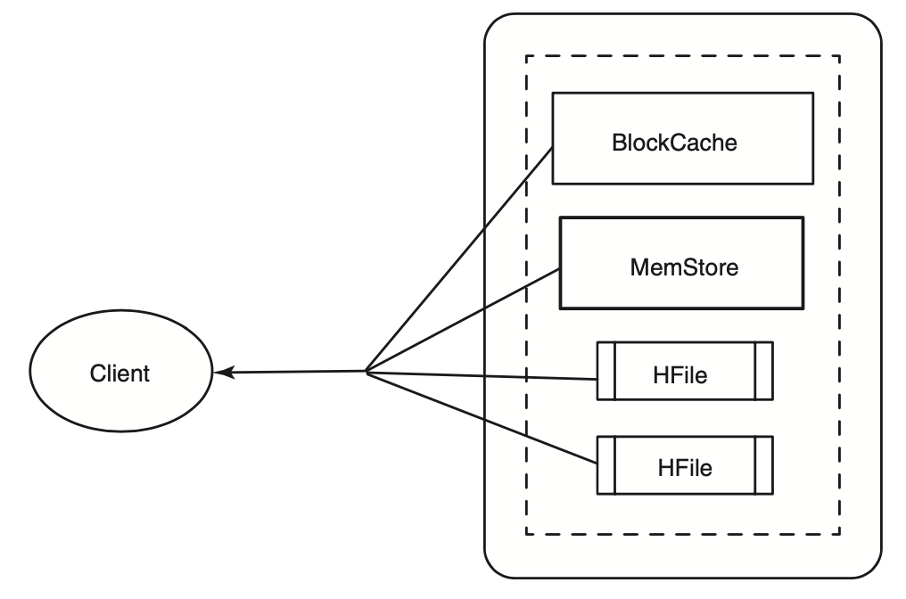
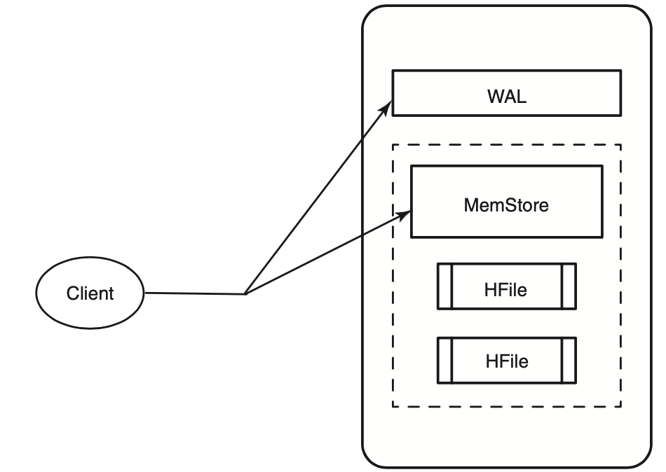

# Spring HBase Demo

## Data models

<p float="left">
    
    
</p>

## Test
1. Create the table `users` with the column family `info`:
```bash
hbase shell
hbase:001:0> create 'users', 'info'
```

2. CRUD for the table `users` via REST API after `./gradlew bootRun`:
```bash
curl http://localhost:8080/users

curl -X POST http://localhost:8080/users -H 'Content-Type: application/json' -d '{"name":"test", "email": "test@gmail.com", "password": "password"}'
curl http://localhost:8080/users/test
curl http://localhost:8080/users/a/z

curl -X POST http://localhost:8080/users -H 'Content-Type: application/json' -d '{"name":"test", "email": "test_updated@gmail.com", "password": "password_updated"}'

curl -X DELETE http://localhost:8080/users/test/email
curl -X DELETE http://localhost:8080/users/test
```